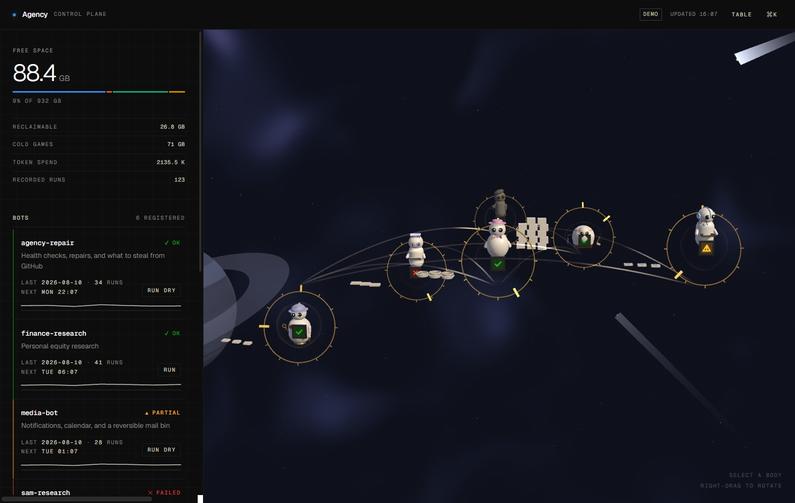
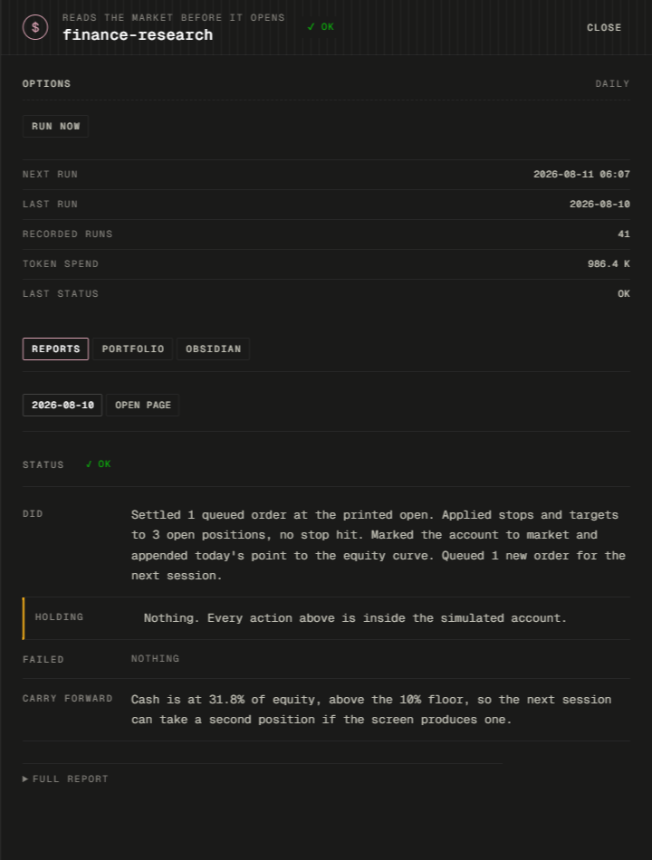
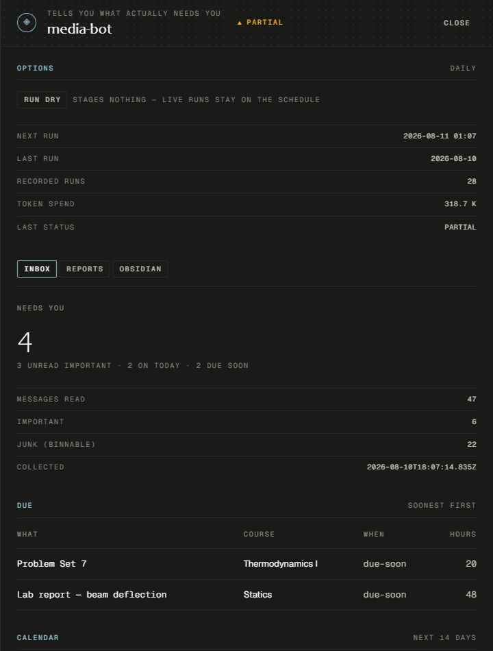
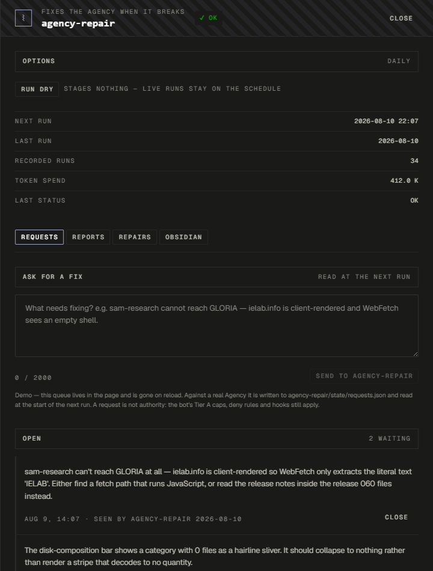

# The Agency

Six autonomous [Claude Code](https://claude.com/claude-code) agents that run on a
schedule with nobody watching, and a browser control plane that shows you what
they did.

**[▶ Open the live demo](https://bnylee.github.io/agency/)** — the real
interface, running against fixture data. No install, no account, no server.



Each agent owns one job, declares exactly which accounts, APIs and file paths it
may touch, and executes only the actions its own contract names as
pre-authorised. Everything else it drafts and leaves for a human. Every
autonomous action is reversible, and no agent anywhere has a path to permanent
deletion.

---

## What the agents do

| Agent | Job | Runs | What it does without asking |
| --- | --- | --- | --- |
| `media-bot` | One digest from Gmail, Microsoft Graph, Canvas and published `.ics` feeds | Daily | Moves junk-classified mail to a label, capped at 200/run, each move recorded with the rule that condemned it. Never deletes, never sends, never replies, never marks read. |
| `finance-research` | Pre-market equity report from SEC EDGAR filings, fundamentals and price data | Weekdays 6:00am | Paper trades only, inside a simulated $10,000 account. No brokerage, no real money, no order routing. |
| `disk-cleanup` | Ranks regenerable files and installed-program footprint by last use | Weekly | Moves scan candidates to a dated quarantine, capped at 25 GB / 5,000 files per run. Never deletes, never uninstalls. |
| `agency-repair` | A request queue you type into, plus deterministic health probes over every agent and the control plane | Daily | Applies a fix to control-plane source where a named probe failed before and passes after, every original file snapshotted first. Capped at 12 files / 400 lines. |
| `sam-research` | Watches OECD, IMF and GLORIA releases and licence terms | Weekly | Nothing. Reports only. |
| `interface-design` | Owns the design system the control plane is generated from | On demand | Nothing. Interactive only. |

## The control plane

A local web interface over the agents' own output. It renders each agent as a
body in a 3D scene where every visual property is bound to real state — status
colour and glyph, a brass ring counting down to the next run, depth by cadence,
physical output beside each body scaled to cumulative token spend, and conduits
between agents derived from which ones actually reference each other in the
repository's own markdown.

Nothing in the scene is decoration. The one exception is documented and argued
for in [`dashboard/README.md`](dashboard/README.md), along with why the camera
is a turntable, why status panels are seated in a `#1a1a19` bezel, and why P&L
is not coloured green and red.

If WebGL is unavailable the table view renders instead and everything still
works. Every control is reachable from a `⌘K` palette.

| | |
| --- | --- |
|  |  |
| A simulated account, read-only | A digest, with the rule that classified each message shown inline |

### Telling the repair agent what to fix



`agency-repair`'s panel opens on a box you type into. The agent reads the queue
at the start of its next run, works the open entries before its own health
check, and reports on each one — done, drafted for approval, or refused with the
rule that blocked it.

**This is the only endpoint that writes into the Agency on a click**, and the
write is deliberately tiny: one hardcoded path, inert JSON text that never
becomes a path or a command line, capped at 2,000 characters and 200 open
requests, written through a rename so a reader never sees a torn file.

**A request is a note asking for something, not authority to do it.** Every
mechanical limit still binds when the agent acts on one — the Tier A cap of 12
files and 400 lines, the deny rules keeping it out of sibling agents, `.claude/`
directories and lockfiles, and its pre-execution hooks. Anything outside them is
refused by a hook rather than by the model's judgement. And only a human closes a
request: the agent marks what it picked up and leaves the status alone, because
an agent that closes its own tickets is grading its own homework.

### Security model

The control-plane API starts PowerShell. That single fact drives every
constraint in [`dashboard/server/index.ts`](dashboard/server/index.ts):

- **Loopback only.** The server refuses to start on a non-loopback host and
  re-checks the peer address on every request.
- **Token in a header, never a cookie.** Browsers attach cookies to cross-site
  requests automatically and will not attach a custom header without a preflight
  this server never approves. That asymmetry is the CSRF defence.
- **No user input reaches a command line.** A request's `:id` selects an entry
  from a hardcoded map; the script path and its arguments come from that entry
  only. `spawn` is called with an argument array and `shell: false`.
- **No purge endpoint, deliberately.** Restore and revert are exposed because
  both put files *back* from copies taken beforehand. Purge is the one operation
  with no inverse, so it is the one operation with no endpoint — it stays behind
  an interactive-console lock at a terminal.

## Permissions are enforced, not documented

A `CLAUDE.md` is context, not configuration. Claude reads it and generally
follows it, but it does not constrain execution — so every rule that matters
exists twice: once as intent in markdown, once as a mechanical constraint that
holds regardless of what the model decides in the moment.

Three specifics, each learned from a scheduled run that failed silently rather
than from a documentation page:

- **Allow rules go in `.claude/settings.local.json`, not `.claude/settings.json`.**
  A project `settings.json`'s allow rules are ignored until the workspace is
  trusted. Under `--permission-mode dontAsk` that denies every call, so a
  scheduled run fails having written nothing — the same way every time, quietly.
- **Deny rules and hooks belong in `.claude/settings.json`.** Both apply
  regardless of trust, and deny always beats allow.
- **File rules use `Edit(path)`, never `Write(path)`.** `Write(...)` rules are
  not evaluated by file permission checks at all, so a `Write(...)` deny
  protecting something sensitive does nothing.

Costly actions additionally sit behind `PreToolUse` hooks — see
[`disk-cleanup/.claude/hooks/`](disk-cleanup/.claude/hooks/) for the pattern.

## Every agent has a dry run

A change that has only been reasoned about is untested. Every agent runs in a
mode that exercises its full logic and renders every external action it would
take, performing none of them, and every behaviour change is validated through
it before it reaches a schedule.

## Running it

The demo above needs nothing. To run the control plane against your own agents:

```bash
cd dashboard
npm install
cp .env.example .env
node -e "console.log(require('crypto').randomBytes(32).toString('hex'))"  # paste into AGENCY_TOKEN
npm run dev            # http://127.0.0.1:5173
```

To build the public demo locally:

```bash
npm run build:demo && npm run preview:demo
```

Tests, none of which need a browser or a network:

```bash
npm run test:scene       # geometry assertions for the 3D scene
npm run test:digest      # the run-report parser, over every report on disk
npm run test:relevance   # the agent-to-agent reference graph scorer
python media-bot/scripts/test_classify.py
python agency-repair/scripts/test_guards.py
```

## What is not in this repository

This is a mirror, built from an allowlist by `publish/make_public.py` in the
private working copy. Three things are held back:

- **`runs/`, `state/`, `repairs/` and `vault/`** — the agents' output, which is
  the personal half. A run report names real senders, real file paths and a real
  account. The code that produces them is all here.
- **Vendored third-party skills** — other people's work under their own
  licences. `interface-design/skills-lock.json` records the source repository
  and upstream commit of each one.
- **Credentials** — no `.env` file is ever copied, and the mirror script exits
  non-zero if a username, an email address or a populated credential survives
  into the output.

## Licence

MIT — see [LICENSE](LICENSE).
